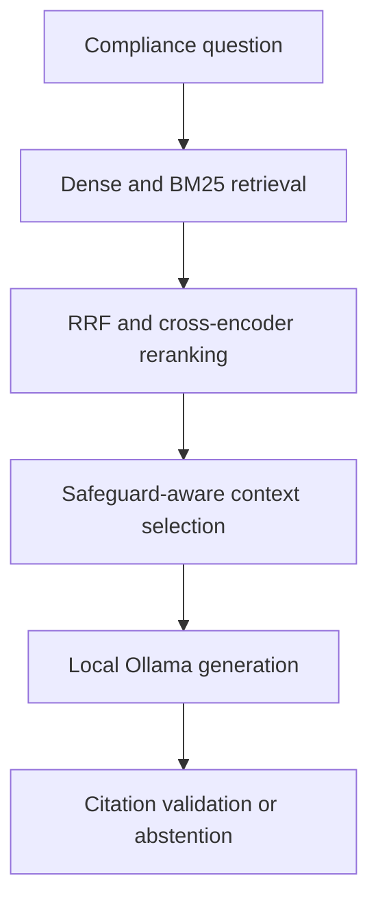

# CIS Controls Compliance RAG

A local, evidence-grounded Retrieval-Augmented Generation system for asking questions about CIS Controls v8.1.

The system combines dense retrieval, BM25, Reciprocal Rank Fusion, cross-encoder reranking and a local Ollama model. Answers include safeguard-level citations and page references from the supplied CIS Controls document.

## Main features

- Local and privacy-focused generation through Ollama
- Metadata-aware CIS safeguard extraction
- Deterministic chunking with stable chunk identifiers
- Dense semantic retrieval using BGE embeddings
- Sparse retrieval using BM25
- Reciprocal Rank Fusion
- Cross-encoder reranking
- Safeguard-aware context selection
- Citation validation and automatic retry
- Safe abstention when evidence is insufficient
- FastAPI REST API and browser frontend
- Liveness and readiness health checks
- JSON request logs with request IDs and timing
- Docker Compose deployment
- Automated GitHub Actions CI
- 160 automated unit and integration tests

## Architecture



## Processing pipeline

| Stage | Implementation | Output |
|---|---|---|
| Extraction | `scripts/extract_safeguards.py` | Structured safeguard records |
| Chunking | `scripts/chunk_safeguards.py` | Metadata-aware text chunks |
| Indexing | `scripts/create_vector_db.py` | Persistent ChromaDB collection |
| Retrieval | `retrieval/` | Ranked evidence chunks |
| Context selection | `generation/context_selector.py` | Safeguard-consistent evidence |
| Generation | `generation/generator.py` | Cited answer or abstention |
| API | `api/main.py` | Validated JSON response |

## Retrieval flow

1. The vector retriever finds semantically similar chunks.
2. BM25 finds chunks with matching terms and safeguard IDs.
3. Reciprocal Rank Fusion combines both rankings.
4. A cross-encoder reranks the fused candidates.
5. The context selector keeps evidence from the most relevant safeguard.
6. Ollama generates an evidence-only answer.
7. Citation validation accepts, retries or abstains.

## Project structure

```text
Compliance-RAG-System/
|-- api/                  FastAPI application
|-- config/               Settings, prompts and logging
|-- data/
|   |-- raw/              Source CIS PDF, excluded from Git
|   `-- processed/        Generated safeguard data, excluded from Git
|-- evaluation/           Retrieval evaluation utilities and datasets
|-- frontend/             HTML, CSS and JavaScript client
|-- generation/           Context selection and answer generation
|-- retrieval/            Dense, BM25, RRF and reranking components
|-- scripts/              Extraction, indexing and smoke-test commands
|-- tests/
|   |-- unit/             Isolated component tests
|   `-- integration/      FastAPI lifecycle and contract tests
|-- .github/workflows/    Continuous integration
|-- Dockerfile            API container definition
|-- compose.yaml          Local container orchestration
`-- requirements.txt      Pinned Python dependencies
```

## Requirements

- Python 3.13
- Ollama
- Git
- CIS Controls v8.1 PDF
- Docker Desktop, optional

The CIS document and generated data are deliberately excluded from Git.

## Local setup

### 1. Create the environment

```powershell
git clone https://github.com/Rishi52/Compliance-RAG-System.git
cd Compliance-RAG-System

python -m venv .venv
.venv\Scripts\Activate.ps1

python -m pip install --upgrade pip
python -m pip install -r requirements-dev.txt
```

### 2. Configure the application

```powershell
Copy-Item ".env.example" ".env"
```

Default generation configuration:

```text
COMPLIANCE_RAG_OLLAMA_MODEL=llama3.2:3b
COMPLIANCE_RAG_OLLAMA_BASE_URL=http://127.0.0.1:11434
```

### 3. Prepare Ollama

```powershell
ollama pull llama3.2:3b
ollama list
```

Confirm its API is available:

```powershell
Invoke-RestMethod `
    -Uri "http://127.0.0.1:11434/api/tags"
```

### 4. Prepare the CIS data

Place the PDF at:

```text
data/raw/CIS_Controls_Guide_v8.1.2_0325_v2.pdf
```

Run the pipeline:

```powershell
python -m scripts.extract_safeguards
python -m scripts.chunk_safeguards
python -m scripts.create_vector_db
```

Expected artifacts:

```text
data/processed/cis_safeguards.json
data/processed/chunked_safeguards.json
chroma_db/
```

### 5. Start the API

```powershell
python -m uvicorn api.main:app `
    --host 127.0.0.1 `
    --port 8000
```

Available endpoints:

- API root: `http://127.0.0.1:8000/`
- Swagger UI: `http://127.0.0.1:8000/docs`
- Liveness: `http://127.0.0.1:8000/health/live`
- Readiness: `http://127.0.0.1:8000/health/ready`

### 6. Start the frontend

In another terminal:

```powershell
python -m http.server 5500 --directory frontend
```

Open:

```text
http://127.0.0.1:5500
```

## API usage

Request:

```powershell
$body = @{
    question = "How often should the enterprise asset inventory be reviewed?"
} | ConvertTo-Json

Invoke-RestMethod `
    -Uri "http://127.0.0.1:8000/chat" `
    -Method Post `
    -ContentType "application/json" `
    -Body $body
```

Example response structure:

```json
{
  "answer": "Review and update the inventory bi-annually, or more frequently. [S1]",
  "sources": [
    {
      "source_id": "S1",
      "chunk_id": "cis-controls-v8.1.2:1.1:001",
      "control_id": "1",
      "control_name": "Inventory and Control of Enterprise Assets",
      "safeguard_id": "1.1",
      "safeguard_name": "Establish and Maintain Detailed Enterprise Asset Inventory",
      "page": 22
    }
  ],
  "citation_valid": true,
  "generation_attempts": 1
}
```

Every API response also contains an `X-Request-ID` header for log correlation.

## Docker deployment

The processed chunk file and Chroma index must already exist before starting the container.

Keep Ollama running on Windows, then run:

```powershell
docker compose build
docker compose up -d
docker compose ps
```

Verify:

```powershell
Invoke-RestMethod `
    -Uri "http://127.0.0.1:8000/health/ready"
```

View structured logs:

```powershell
docker compose logs --tail=100 api
```

Stop the service without deleting the model cache:

```powershell
docker compose down
```

Do not use `docker compose down -v` unless you intentionally want to remove the Hugging Face cache.

## Testing

Run the complete test suite:

```powershell
python -m pytest -q
```

Run individual groups:

```powershell
python -m pytest tests\unit -q
python -m pytest tests\integration -q
```

Additional checks:

```powershell
python -m compileall -q `
    api `
    config `
    evaluation `
    generation `
    retrieval `
    scripts `
    tests

python -m pip check
git diff --check
```

GitHub Actions automatically executes the quality checks for pushes and pull requests.

## Structured logs

Application requests produce one JSON record per line:

```json
{
  "timestamp": "2026-09-05T10:30:00+00:00",
  "level": "INFO",
  "logger": "api.main",
  "message": "HTTP request completed.",
  "request_id": "40f94514-a229-46ba-a579-a7fc76f8134e",
  "method": "POST",
  "path": "/chat",
  "status_code": 200,
  "duration_ms": 2451.72
}
```

Question text and retrieved evidence are not written to request logs.

## Privacy and data handling

- Generation runs through the configured Ollama server.
- Compliance questions are not sent to a hosted LLM.
- The CIS PDF, processed records and Chroma database are excluded from Git.
- Hugging Face is contacted when retrieval models must initially be downloaded.
- Model files are cached locally or in the Docker volume.

## Current limitations

- The application is intended for local or controlled environments.
- Authentication and user authorization are not currently implemented.
- The API uses one model worker to avoid duplicate memory use.
- Readiness verifies the retrieval index but does not prove that Ollama has the requested model loaded.
- Generated answers should support compliance analysis, not replace professional audit judgment.

## Quality status

- 153 tests before observability
- 160 tests after observability
- Automated Python 3.13 CI
- Dockerfile and Compose validation
- Citation checking and safe abstention
- No external model required during automated tests